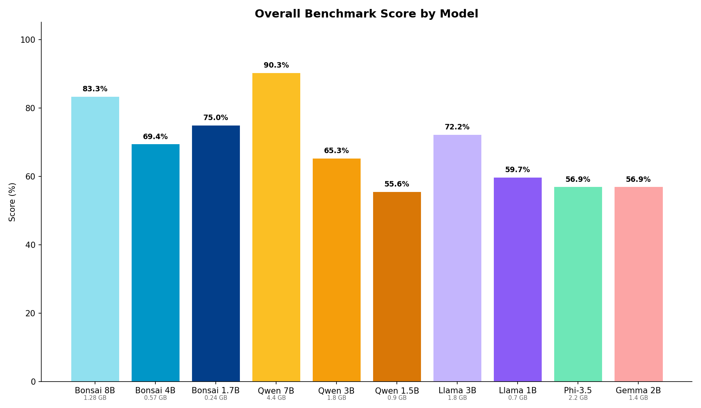
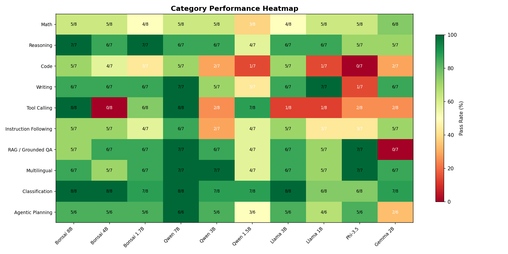
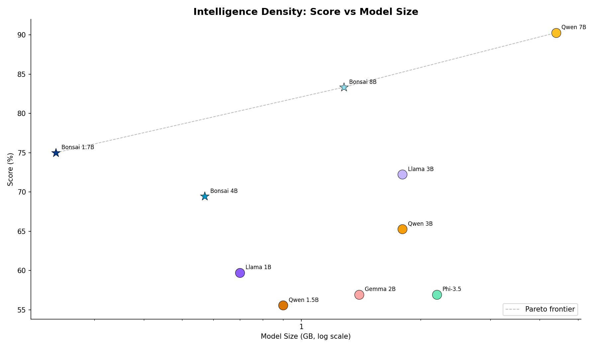
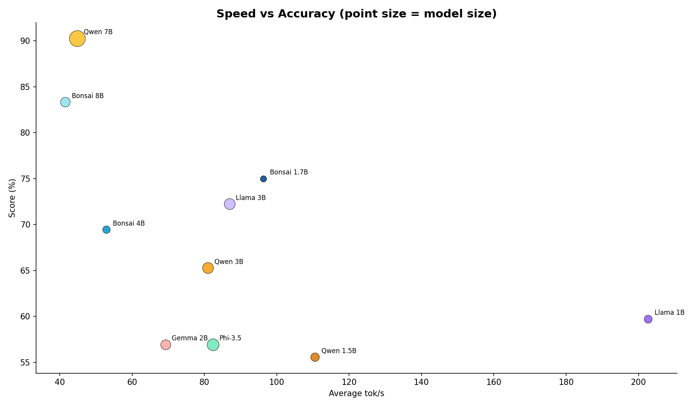
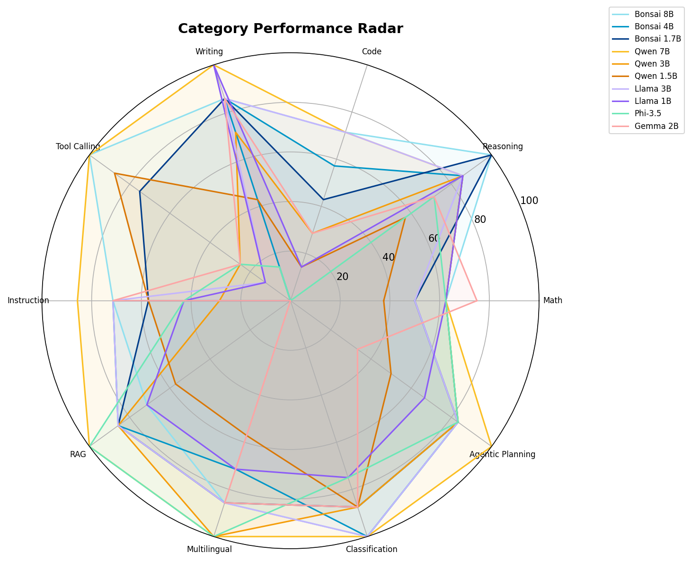

# MLX Bonsai Benchmarks — Visual Report

## Overall Comparison

Grouped bar chart showing each model's overall benchmark score. 
Model sizes annotated below each bar.

## Category Heatmap

Pass rate by category for every model. Green = strong, red = weak.

## Intelligence Density

Score vs model size on a log scale. Stars = Bonsai (1-bit), circles = others (4-bit). 
Models above the Pareto frontier offer the best quality-per-byte.

## Speed vs Accuracy

Trade-off between inference speed and benchmark accuracy. 
Point size proportional to model disk size.

## Category Radar

Spider chart overlaying all models across the 10 benchmark categories.
